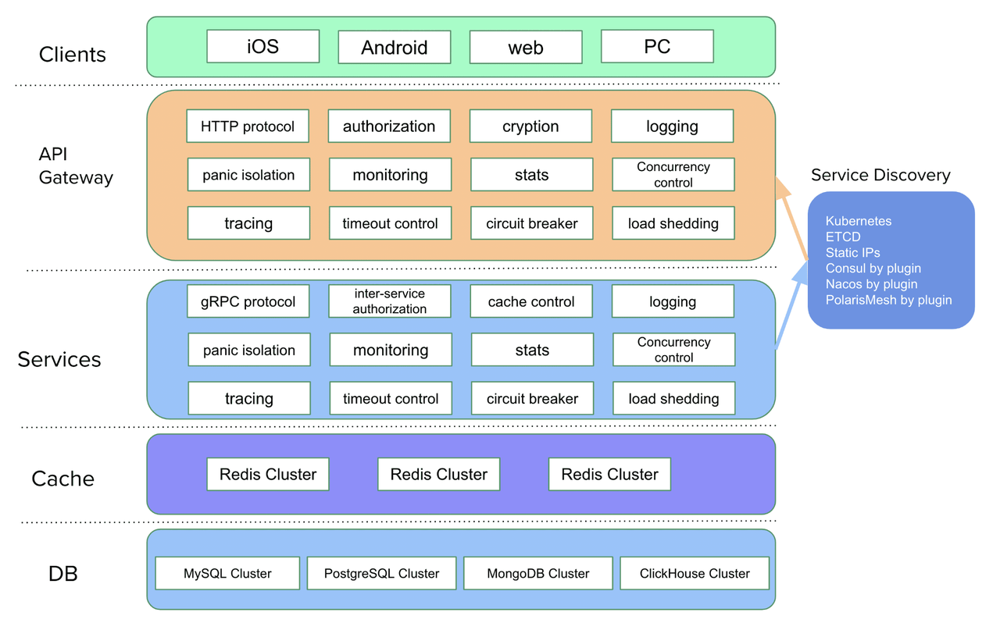
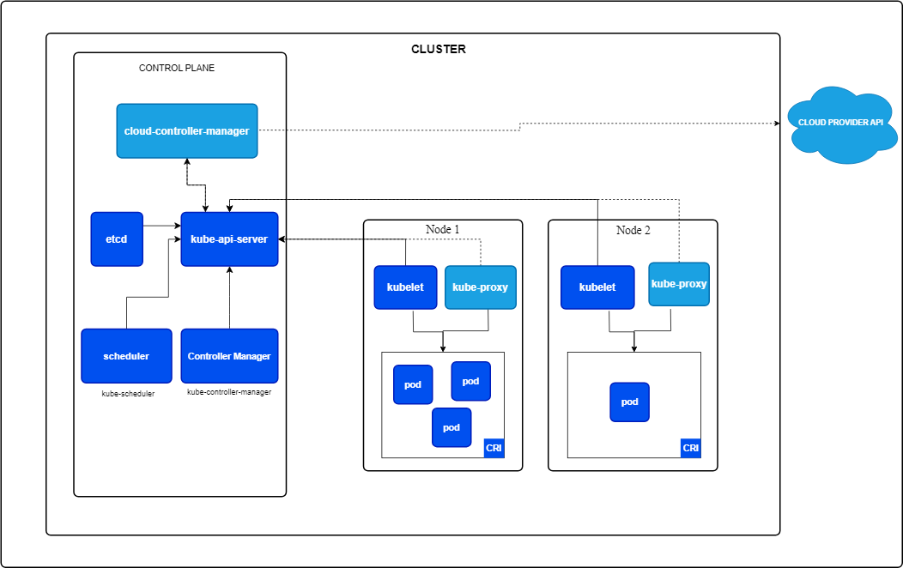
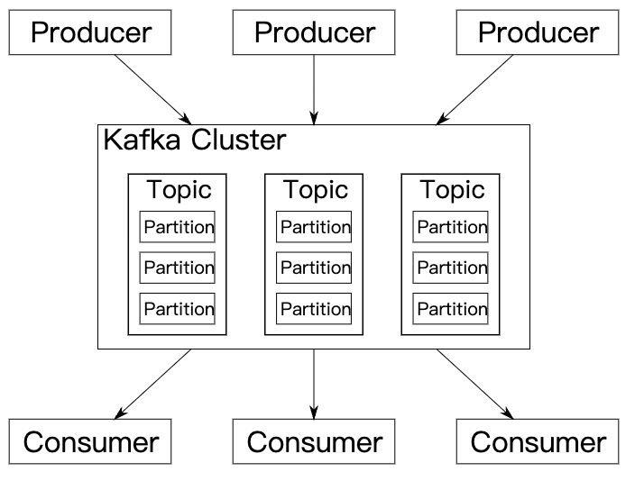
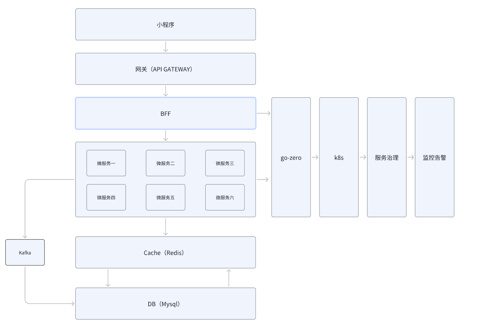
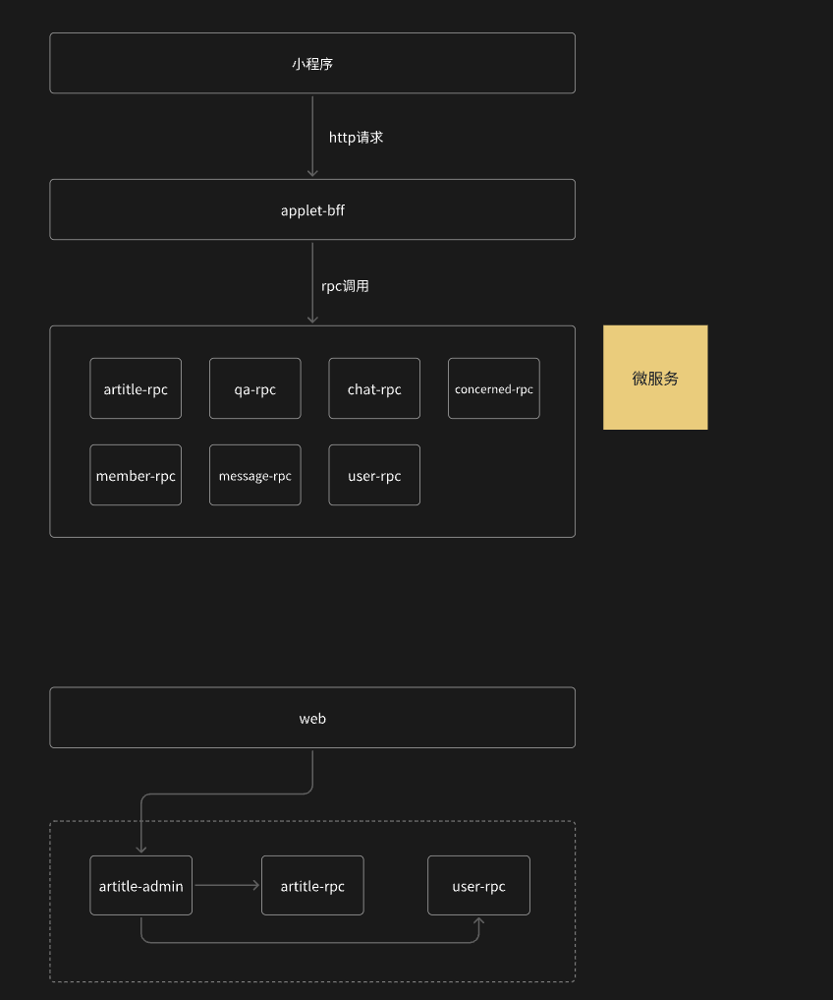

# 项目简介

## 项目特点

该项目后绝大多数有golang实现，主要特点是，支持微服务，高并发，可以上线部署

该项目主要学习了github.com/zhoushuguang/beyond

- 采用微服务架构设计，从单体架构到微服务架构，如何拆
- 高并发，模拟高并发场景，面对高并发时的性能优化以及架构调整
- 最终会部署上线

## 项目技术栈

go-zero + k8s + mysql + redis + kafka

- go-zero：是一个集成了各种工程实践的 web 和 rpc 框架。通过弹性设计保障了大并发服务端的稳定性，经受了充分的实战检验。 
网址介绍：https://landscape.cncf.io/?selected=go-zero

- 服务编排 kubernetes，Kubernetes（常简称为K8s）是用于自动部署、扩展和管理“容器化（containerized）应用程序”的开源系统。



- 数据库 mysql，MySQL在过去由于性能高、成本低、可靠性好，已经成为最流行的开源数据库，因此被广泛地应用在Internet上的中小型网站中。随着MySQL的不断成熟，它也逐渐用于更多大规模网站和应用，比如维基百科、Google和Facebook等网站。非常流行的开源软件组合LAMP中的“M”指的就是MySQL。
- 缓存 redis，Redis（Remote Dictionary Server）是一个使用ANSI C编写的开源、支持网络、基于内存、分布式、可选持久性的键值对存储数据库。根据月度排行网站DB-Engines.com的数据，Redis是最流行的键值对存储数据库。
- 消息队列 kafka，Kafka是由Apache软件基金会开发的一个开源流处理平台，由Scala和Java编写。该项目的目标是为处理实时数据提供一个统一、高吞吐、低延迟的平台。其持久化层本质上是一个“按照分布式事务日志架构的大规模发布/订阅消息队列”，([4])这使它作为企业级基础设施来处理流式数据非常有价值。


## 项目架构



## 核心功能点

- zero-examples 所有功能全部在项目中体现
- 服务注册与发现，负载均衡
- 监控 && 告警 && 链路追踪
- 缓存异常的处理，穿透、击穿、雪崩、缓存数据库一致性保证
- 秒杀场景，超高并发的读写（10w QPS，压测）
- 请求耗时高如何优化
- 聊天室
- 问题排查定位方法
- CI/CD 完整部署上线，并可访问

## 主要产品

达到一个仿知乎的产品

微服务的拆分


# 设计文档和地址

设计文档和相关地址：
设计文档来源于github.com/zhoushuguang/beyond

# 文件和目录结构

```shell
tree -L 1 ./
./
├── README.md
├── application
├── db
├── go.mod
├── go.sum
└── pkg
```
我们可以理解首先db里面放的主要是sql文件
application中都是一个个的微服务的文件夹
pkg就是一些第三方库相关的内容